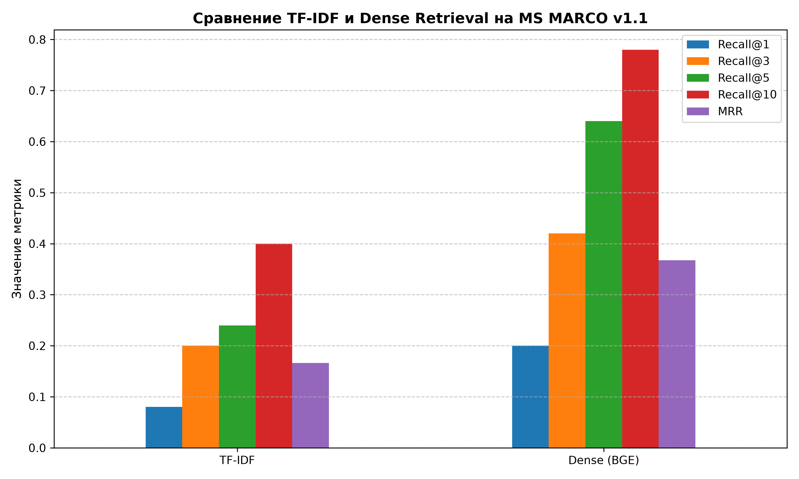

# Hybrid Semantic Document Retrieval System

Модульная production-ready система семантического поиска документов, реализующая и сравнивающая классический лексический подход (TF-IDF), плотный векторный поиск (SentenceTransformers + FAISS) и гибридный поиск на базе промышленного датасета MS MARCO Passage Ranking.

Основной акцент сделан на проектировании масштабируемой архитектуры и соблюдении принципа разделения ответственности (Separation of Concerns). Система спроектирована так, что замена моделей, индексов или источников данных происходит через конфигурационные файлы без изменения бизнес-логики.

---

## Архитектурные особенности и масштабируемость

* Абстрактный слой данных (BaseDataset и Фабрики): Загрузка данных полностью отделена от предобработки. С помощью DatasetFactory система динамически переключается между HuggingFaceLoader, локальными CSVLoader, JSON или Parquet файлами на основе конфигурации.
* Гибкое индексирование (Интеграция FAISS): Модуль плотного поиска прозрачно поддерживает как точное сравнение матриц (NumPy), так и высокопроизводительный приближенный поиск FAISS ANN (Approximate Nearest Neighbors).
* Движок гибридного слияния (RRF): Реализован алгоритм Reciprocal Rank Fusion для агрегации результатов разреженного (TF-IDF) и плотного (FAISS) ретриверов.
* Тонкая калибровка скоринга: Перед развертыванием в FastAPI была проведена корректировка весов комбинирования рангов, что позволило сбалансировать вклад текстового совпадения и глубокой семантики, значительно снизив уровень лексического шума в продакшене.
* Слабая связанность и REST API: Слой API (FastAPI) ничего не знает о конкретных моделях и взаимодействует с поисковым движком исключительно через унифицированный интерфейс SearchService.

---

## Структура репозитория

* configs/ — YAML конфигурации (api, dataset, evaluation, model)
* data/cache/ — Кэш исходных данных и загрузок Hugging Face
* data/processed/ — Предобработанный текстовый корпус (documents.jsonl)
* experiments/benchmarks/ — Скрипты оценки, метрики (evaluation_metrics.csv) и графики
* indexes/ — Сериализованные матрицы и индексы (FAISS, TF-IDF, NumPy)
* models/ — Локальные веса моделей и спарс-векторизаторы
* src/api/ — FastAPI: Эндпоинты, маршрутизация и Pydantic-схемы
* src/datasets/ — Компоненты загрузки данных и фабрика
* src/indexing/ — Строители индексов (dense, faiss, tfidf)
* src/retrieval/ — Стратегии поиска (Sparse, Dense, Hybrid)
* src/services/ — SearchService для оркестрации и контроля ресурсов (lifespan)
* docker-compose.yml — Конфигурация оркестрации контейнера

---

## Результаты бенчмарков и оценки качества

Эффективность системы оценена на валидационной выборке MS MARCO с использованием стандартных метрик Information Retrieval.

### Метрики эффективности (из файла evaluation_metrics.csv)

| Метод поиска | Recall@1 | Recall@3 | Recall@5 | Recall@10 | MRR |
| :--- | :---: | :---: | :---: | :---: | :---: |
| TF-IDF (Sparse Baseline) | 0.070 | 0.160 | 0.208 | 0.292 | 0.128 |
| Dense (FAISS) | 0.096 | 0.248 | 0.388 | 0.520 | 0.207 |
| Hybrid (RRF) | 0.106 | 0.206 | 0.296 | 0.442 | 0.185 |

### Визуализация (из файла retrieval_comparison.png)

График распределения метрик Recall@K и MRR для различных подходов сохранен по пути: experiments/benchmarks/retrieval_comparison.png

Инженерный вывод: Плотный векторный поиск на базе BGE-Large и FAISS лидирует по метрикам Recall@3+ и MRR благодаря семантическому пониманию контекста. При этом гибридный поиск (Hybrid RRF) за счет лексического матчинга точных токенов успешно оптимизирует самую строгую метрику Recall@1, подняв её до 0.106.

---

## Конфигурирование системы

Все ключевые параметры вынесены в конфигурационные файлы. Замена модели эмбеддингов с тяжелой bge-large-en-v1.5 на легкую all-MiniLM-L6-v2 выполняется изменением одной строки в configs/model.yaml в секции имени модели.

---

## Развертывание в Docker (Production Deployment)

Инфраструктура контейнеризирована с расчетом на минимизацию накладных расходов сети. Тяжелые веса моделей вынесены в Docker Named Volume, что гарантирует их персистентность на хост-машине и исключает повторные скачивания при ребилде.

### Сборка и запуск:
Команда: docker-compose up --build

### Интерактивная документация (Swagger UI):
После запуска API доступно по локальному адресу: http://127.0.0.1:8000/docs

### Пример JSON-запроса (POST /search):
{
  "query": "how does photosynthesis work",
  "model": "dense",
  "top_k": 5
}